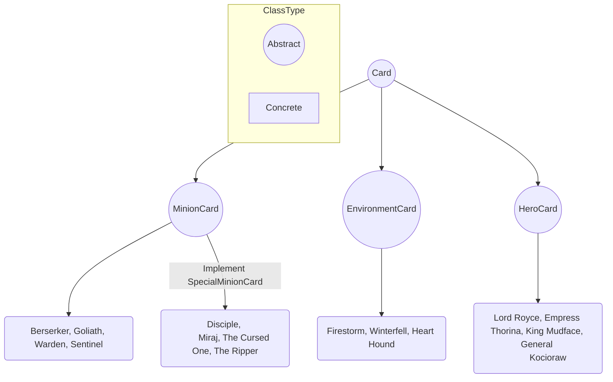

# Text Based Game - GwentStone

#### Made by: [Gabriela Limberea - 322CA](https://github.com/Gabi-Limberea)

## __Description__:

__GwentStone__ is a text based game, where two players can play against each
other. The game is based on the card games Hearthstone and Gwent, from the
Witcher series.

## __Gameplay__:

* A __session__ between two players can have __multiple games__. At the
  beginning of the session, the players have a set of different decks to choose
  from and the list of games that they will play.

* At the beginning of a __game__, the players choose a deck to use from
  their lists and a __hero__ to play with. The AI will decide who the
  starting player will be.

* During a game, players will take turns to place cards on the board and
  attack the opponent's hero and minions. The game ends when one of the
  players' __hero__ reaches 0 health points.

## __Design and Implementation__:

The game was implemented using 4 major classes:

* __Session__:
	* loads the session data: players and list of games
	* starts the games in sequential order and takes care of the cleanup
	  between each game
* __Game__:
	* loads the game data: players' preferences (deck and hero), and the
	  commands that will be given during the game
	* manages the game logic: command handling, end turn cleanup, game
	  output and end of game cleanup (clears the board and the players' hands,
	  resets their mana)
* __Player__:
	* manages the player's data: name, list of decks, hero used in current
	  game, mana in current game, hand in current game
	* manages the player's actions: draw a card, place a card on board,
	  basic attack (hero or minion), use a minion's special attack, use an
	  environment card, check their hand
* __Card__:
	* is the base for all the cards in the game (minions, environment, heroes)
	* is abstract
	* stores the card's base data: name, description, mana cost, colors

In order to model each card type and its behavior, the ___Card___ class had
to be extended, thus resulting the following hierarchy:

In the concrete classes, there are only implemented the card type specifics
(e.g. for the hero cards, the hero's special abilities are implemented in
their respective class). In the abstract classes, there are already
implemented generally applicable methods, such as getters and setters for
the common fields that are inherited, but there are also the abstracted methods
to be implemented in the concrete classes. There are also some helper
classes and enums.